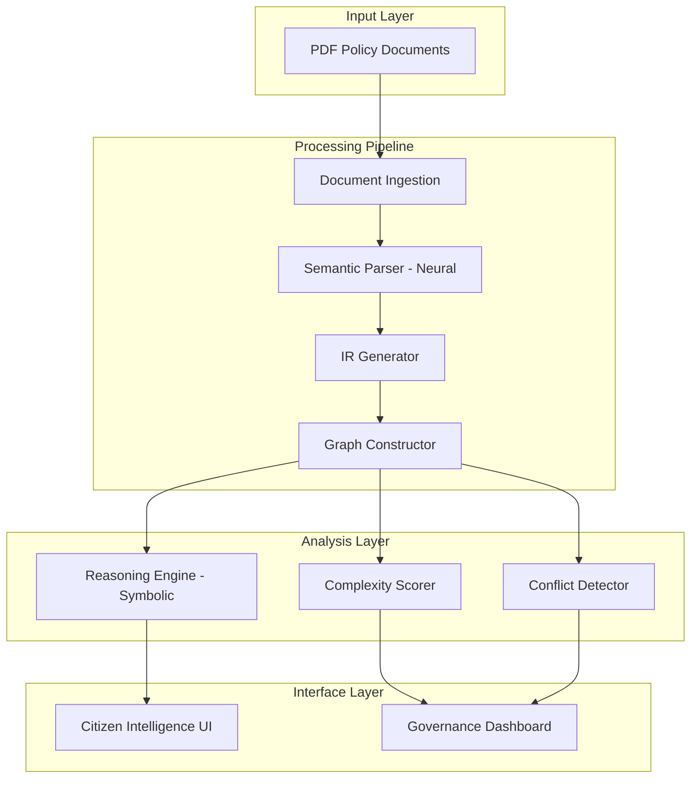

# Design Document: POLICYGRAPH AI 2.0

## Overview

POLICYGRAPH AI 2.0 implements a hybrid neuro-symbolic architecture that transforms unstructured government policy documents into structured, queryable logical graphs. The system combines neural language models for semantic parsing with symbolic reasoning engines for deterministic inference, ensuring both flexibility in handling natural language and explainability in decision-making.

The architecture follows a pipeline design with six core stages:

1. **Document Ingestion** - PDF text extraction with quality validation
2. **Semantic Parsing** - Neural extraction of policy clauses and entities
3. **Intermediate Representation** - Structured conversion to logical format
4. **Graph Construction** - Building queryable policy knowledge graphs
5. **Reasoning & Analysis** - Eligibility evaluation, complexity scoring, conflict detection
6. **Dual-Layer Interface** - Citizen and governance dashboards

The design adheres to the three core principles: Transparency by Design, Neuro-Symbolic Integrity, and Responsible Governance.

## Architecture

### High-Level Architecture



### Component Interaction Flow

1. **Ingestion → Parsing**: Raw text with quality metrics
2. **Parsing → IR**: Extracted clauses with confidence scores
3. **IR → Graph**: Structured nodes and edges with logical relationships
4. **Graph → Reasoning**: Query interface for eligibility evaluation
5. **Graph → Scoring**: Structural metrics for complexity analysis
6. **Graph → Detection**: Logical validation for conflict identification

### Technology Stack Considerations

- **Neural Parsing**: Transformer-based models (BERT, RoBERTa, or domain-specific legal language models)
- **Symbolic Reasoning**: Logic programming (Prolog-style) or rule engines (Drools, Rete algorithm)
- **Graph Storage**: Property graph database (Neo4j) or in-memory graph structures
- **API Layer**: RESTful API with JSON responses
- **Frontend**: Interactive visualization (D3.js, Cytoscape.js for graph rendering)

## Components and Interfaces

### 1. Document Ingestion Module

**Responsibility**: Extract text from PDF documents and validate quality.

**Interface**:
```
Input: PDF file (binary)
Output: ExtractedDocument {
  document_id: string,
  raw_text: string,
  extraction_quality: float,
  timestamp: datetime,
  metadata: {
    page_count: int,
    language: string
  }
}
```

**Implementation Approach**:
- Use PDF parsing library (PyPDF2, pdfplumber, or Apache PDFBox)
- Validate text extraction by checking:
  - Presence of expected policy keywords
  - Sentence structure integrity
  - Character encoding validity
- Reject documents with quality score below threshold (0.7)

**Error Conditions**:
- Unsupported PDF format → Return error with format details
- Non-English text detected → Return language error
- Extraction quality below threshold → Return quality error with score

### 2. Semantic Parser (Neural Component)

**Responsibility**: Extract policy clauses, entities, and relationships using neural language models.

**Interface**:
```
Input: ExtractedDocument
Output: ParsedClauses {
  clauses: List[Clause],
  entities: List[Entity],
  extraction_metadata: {
    model_version: string,
    processing_time: float
  }
}

Clause {
  clause_id: string,
  text: string,
  clause_type: enum[ELIGIBILITY, DISQUALIFICATION, DOCUMENTATION, DEFINITION, CROSS_REFERENCE],
  confidence: float,
  source_location: {
    document_id: string,
    page: int,
    char_offset: int
  },
  ambiguity_flag: bool,
  ambiguity_reason: string?
}

Entity {
  entity_id: string,
  text: string,
  entity_type: enum[THRESHOLD, CONDITION, STAKEHOLDER, DOCUMENT_TYPE],
  value: string?,
  confidence: float
}
```

**Implementation Approach**:
- Fine-tune transformer model on annotated policy documents
- Use named entity recognition (NER) for threshold extraction
- Apply dependency parsing for nested clause detection
- Implement confidence calibration to ensure scores reflect true accuracy
- **Hallucination Mitigation**: All extracted clauses MUST map to exact character spans in the source document. The system SHALL reject any generative clauses without span alignment. This ensures extraction is strictly grounded in document text.
- Flag ambiguity when:
  - Multiple valid interpretations exist
  - Vague quantifiers detected ("reasonable", "adequate")
  - Pronoun references unclear
  - Conditional logic is complex (>3 nested levels)

**Key Challenges**:
- Handling legal terminology and domain-specific language
- Detecting implicit conditions not explicitly stated
- Resolving co-references across sentences

**Partial Failure Handling**:
If semantic parsing partially fails, the system SHALL proceed with high-confidence clauses (confidence ≥ 0.7) and flag low-confidence clauses for manual review. This ensures resilience and allows partial processing rather than complete failure.

### 3. Intermediate Representation (IR) Generator

**Responsibility**: Convert parsed clauses into structured logical format.

**Interface**:
```
Input: ParsedClauses
Output: IntermediateRepresentation {
  rules: List[LogicalRule],
  schema_version: string
}

LogicalRule {
  rule_id: string,
  variable: string,
  operator: enum[EQ, NEQ, LT, LTE, GT, GTE, IN, NOT_IN, AND, OR, NOT],
  value: any,
  clause_reference: string,
  confidence: float,
  logical_group: string?,
  children: List[LogicalRule]?
}
```

**Implementation Approach**:
- Map clause types to logical operators:
  - "must be" → EQ
  - "less than" → LT
  - "at least" → GTE
  - "except" → NOT
  - "and" → AND
  - "or" → OR
- Build tree structure for nested conditions
- Preserve source clause references for explainability
- Validate schema compliance before output

**Schema Validation**:
- All rules must have: rule_id, variable, operator, clause_reference
- Confidence scores must be in [0, 1]
- Operators must match value types (numeric operators require numeric values)
- Circular references are prohibited

**Pretty Printer**:
The IR Generator includes a pretty printer that converts LogicalRule structures back to human-readable policy text:
```
Input: LogicalRule
Output: string (human-readable policy statement)
```

Example:
```
LogicalRule(variable="age", operator=GTE, value=18, AND LogicalRule(variable="income", operator=LT, value=50000))
→ "Applicant must be at least 18 years old AND have income less than 50,000"
```

### 4. Graph Constructor

**Responsibility**: Build queryable policy knowledge graph from IR.

**Interface**:
```
Input: IntermediateRepresentation
Output: PolicyGraph {
  nodes: List[Node],
  edges: List[Edge],
  metadata: GraphMetadata
}

Node {
  node_id: string,
  node_type: enum[POLICY, CLAUSE, CONDITION, ENTITY, THRESHOLD],
  properties: dict,
  confidence: float
}

Edge {
  edge_id: string,
  source_node: string,
  target_node: string,
  relationship: enum[CONTAINS, DEPENDS_ON, CONFLICTS_WITH, MODIFIES, APPLIES_TO, REQUIRES],
  properties: dict
}
```

**Implementation Approach**:
- Create policy node for each document
- Create clause nodes for each logical rule
- Create condition nodes for atomic predicates
- Create edges based on logical relationships:
  - AND/OR create DEPENDS_ON edges
  - NOT creates negation property
  - Cross-references create APPLIES_TO edges
- Index nodes for efficient querying

### 5. Reasoning Engine (Symbolic Component)

**Responsibility**: Perform eligibility evaluation using backward and forward chaining.

**Interface**:
```
Input: EligibilityQuery {
  policy_id: string,
  user_inputs: dict[string, any]
}

Output: EligibilityResult {
  status: enum[ELIGIBLE, NOT_ELIGIBLE, CONDITIONAL],
  reasoning_trace: List[ReasoningStep],
  confidence: float,
  conditional_requirements: List[string]?
}

ReasoningStep {
  step_number: int,
  rule_evaluated: string,
  clause_reference: string,
  input_values: dict,
  result: bool,
  confidence: float,
  explanation: string
}
```

**Implementation Approach**:

**Backward Chaining** (for eligibility evaluation):
1. Start with goal: "Is user eligible?"
2. Traverse graph from policy node to condition nodes
3. Evaluate each condition against user inputs
4. Propagate results up through logical operators (AND/OR/NOT)
5. Generate reasoning trace at each step
6. Compute overall confidence as minimum of step confidences

**Forward Chaining** (for scenario simulation):
1. Start with user inputs
2. Apply all applicable rules
3. Derive all possible conclusions
4. Show which policies become eligible/ineligible as inputs change

**Confidence Propagation**:
- AND: min(confidence_1, confidence_2)
- OR: max(confidence_1, confidence_2)
- NOT: confidence (unchanged)

### 6. Complexity Scorer

**Responsibility**: Compute policy complexity metrics.

**Interface**:
```
Input: PolicyGraph
Output: ComplexityScore {
  overall_score: float,
  category: enum[LOW, MODERATE, HIGH],
  factors: {
    condition_count: int,
    operator_density: float,
    nesting_depth: int,
    cross_reference_count: int,
    readability_score: float,
    ambiguity_count: int
  },
  explanation: string
}
```

**Implementation Approach**:

**Scoring Formula**:
```
complexity_score = w1 * normalize(condition_count) +
                   w2 * normalize(operator_density) +
                   w3 * normalize(nesting_depth) +
                   w4 * normalize(cross_reference_count) +
                   w5 * (1 - readability_score) +
                   w6 * normalize(ambiguity_count)

where weights sum to 1: w1 + w2 + w3 + w4 + w5 + w6 = 1
```

**Suggested Weights** (tunable based on domain expertise):
- w1 = 0.20 (condition count)
- w2 = 0.15 (operator density)
- w3 = 0.25 (nesting depth - most impactful)
- w4 = 0.15 (cross-references)
- w5 = 0.15 (readability)
- w6 = 0.10 (ambiguity)

**Normalization**:
- condition_count: divide by max observed (or use sigmoid)
- operator_density: (AND + OR + NOT count) / total_clauses
- nesting_depth: divide by max depth (typically 5)
- cross_reference_count: divide by total_clauses
- readability_score: use Flesch-Kincaid or similar (already 0-1)
- ambiguity_count: divide by total_clauses

**Category Thresholds**:
- LOW: score < 0.33
- MODERATE: 0.33 ≤ score < 0.67
- HIGH: score ≥ 0.67

### 7. Conflict Detector

**Responsibility**: Identify logical conflicts within and across policies.

**Interface**:
```
Input: PolicyGraph (single or multiple policies)
Output: ConflictReport {
  conflicts: List[Conflict],
  conflict_count: int
}

Conflict {
  conflict_id: string,
  conflict_type: enum[DIRECT_CONTRADICTION, MUTUAL_EXCLUSION, CIRCULAR_DEPENDENCY, INCOMPATIBLE_THRESHOLD, LOGICAL_IMPOSSIBILITY],
  severity: enum[LOW, MEDIUM, HIGH, CRITICAL],
  involved_clauses: List[string],
  explanation: string,
  evidence: dict
}
```

**Implementation Approach**:

**Conflict Detection Algorithms**:

1. **Direct Contradiction**: Same variable with conflicting requirements
   - Example: "age >= 18" AND "age < 18"
   - Detection: Check for same variable with mutually exclusive operators

2. **Mutual Exclusion**: Policies that cannot both apply
   - Example: Policy A requires "income < 50000", Policy B requires "income > 60000"
   - Detection: Check if satisfying one policy makes another impossible

3. **Circular Dependency**: Policy A requires B, B requires A
   - Detection: Cycle detection in dependency graph (DFS with visited tracking)

4. **Incompatible Threshold**: Overlapping ranges with different outcomes
   - Example: "18 ≤ age < 25" eligible, "20 ≤ age < 30" ineligible
   - Detection: Interval overlap analysis

5. **Logical Impossibility**: Conditions that cannot be simultaneously true
   - Example: "must be student" AND "must have 10 years work experience"
   - Detection: Domain knowledge rules + constraint satisfaction

**Severity Assignment**:
- CRITICAL: Makes policy unevaluable (circular dependency, direct contradiction)
- HIGH: Affects large population (incompatible thresholds across major policies)
- MEDIUM: Affects specific scenarios (mutual exclusion in edge cases)
- LOW: Minor inconsistencies (documentation requirements differ slightly)

**Validation of Logical Scope**:
Before flagging a conflict, verify both clauses are active in the same evaluation context:
- Check if clauses are in the same policy or linked policies
- Verify no conditional scoping separates them
- Confirm both apply to the same entity type

**Computational Complexity**:
- Direct contradiction detection: O(n) where n = number of clauses
- Mutual exclusion detection: O(n²) worst case (pairwise comparison)
- Circular dependency detection: O(V + E) using depth-first search on graph
- Incompatible threshold detection: O(n log n) with interval tree
- Overall conflict detection: O(n²) worst case, optimizable with indexing

### 8. Citizen Intelligence Interface

**Responsibility**: Provide user-friendly eligibility checking.

**Features**:
- Input form for eligibility variables
- Real-time eligibility evaluation
- Clause-referenced explanations with source citations
- Plain language summaries
- Scenario simulation (what-if analysis)
- Low-confidence warnings when confidence < 0.6

**User Flow**:
1. User selects policy
2. User enters personal information
3. System evaluates eligibility
4. System displays result with reasoning trace
5. User can modify inputs to simulate scenarios

### 9. Governance Intelligence Dashboard

**Responsibility**: Provide analytical tools for policymakers.

**Features**:
- Policy complexity dashboard with comparative rankings
- Conflict visualization graph (interactive)
- Clause-level structure view
- Ambiguity indicators with severity
- JSON API export for integration

**Visualizations**:
- Complexity heatmap across policies
- Conflict network graph
- Nesting depth tree view
- Ambiguity distribution chart

## Data Models

### Core Data Structures

**ExtractedDocument**:
```python
{
  "document_id": "uuid",
  "raw_text": "string",
  "extraction_quality": 0.95,
  "timestamp": "2024-01-15T10:30:00Z",
  "metadata": {
    "page_count": 12,
    "language": "en"
  }
}
```

**Clause**:
```python
{
  "clause_id": "uuid",
  "text": "Applicant must be at least 18 years old",
  "clause_type": "ELIGIBILITY",
  "confidence": 0.92,
  "source_location": {
    "document_id": "uuid",
    "page": 3,
    "char_offset": 1250
  },
  "ambiguity_flag": false,
  "ambiguity_reason": null
}
```

**LogicalRule** (Intermediate Representation):
```python
{
  "rule_id": "uuid",
  "variable": "age",
  "operator": "GTE",
  "value": 18,
  "clause_reference": "clause_uuid",
  "confidence": 0.92,
  "logical_group": "group_1",
  "children": []
}
```

**PolicyGraph Node**:
```python
{
  "node_id": "uuid",
  "node_type": "CONDITION",
  "properties": {
    "variable": "age",
    "operator": "GTE",
    "value": 18,
    "clause_reference": "clause_uuid"
  },
  "confidence": 0.92
}
```

**PolicyGraph Edge**:
```python
{
  "edge_id": "uuid",
  "source_node": "node_uuid_1",
  "target_node": "node_uuid_2",
  "relationship": "DEPENDS_ON",
  "properties": {
    "logical_operator": "AND"
  }
}
```

### Database Schema Considerations

If using a graph database (Neo4j):
- Nodes: Policy, Clause, Condition, Entity
- Relationships: CONTAINS, DEPENDS_ON, CONFLICTS_WITH, APPLIES_TO
- Properties: All metadata stored as node/edge properties
- Indexes: On document_id, clause_id, variable names for fast querying

If using relational database:
- Tables: documents, clauses, rules, nodes, edges, conflicts
- Foreign keys: Maintain referential integrity
- Indexes: On frequently queried fields

## Correctness Properties


*A property is a characteristic or behavior that should hold true across all valid executions of a system—essentially, a formal statement about what the system should do. Properties serve as the bridge between human-readable specifications and machine-verifiable correctness guarantees.*

### Property 1: Document Ingestion Preserves Structure

*For any* valid machine-readable PDF Policy_Document, when the system extracts text, the extraction should preserve clause structure integrity such that sentence boundaries, paragraph breaks, and clause separations remain identifiable.

**Validates: Requirements 1.1**

### Property 2: Invalid Documents Return Appropriate Errors

*For any* PDF document that fails extraction or contains unsupported formats, the system should return an error message indicating the specific issue (format unsupported, low quality, or non-English language).

**Validates: Requirements 1.2, 1.4**

### Property 3: Successful Ingestion Produces Unique Identifiers

*For any* successfully ingested Policy_Document, the system should assign a unique document identifier and valid timestamp, such that no two documents share the same identifier.

**Validates: Requirements 1.3**

### Property 4: All Confidence Scores Are Normalized

*For any* confidence score generated by the system (clause extraction, reasoning steps, entity extraction), the value should be in the range [0, 1].

**Validates: Requirements 2.7, 4.6, 11.1**

### Property 5: Ambiguous Clauses Are Flagged

*For any* clause that the system identifies as ambiguous, the clause should have an ambiguity marker set to true and include an ambiguity reason.

**Validates: Requirements 2.8**

### Property 6: Intermediate Representation Conforms to Schema

*For any* generated Intermediate_Representation, the structure should validate against the defined schema with all required fields (rule_id, variable, operator, clause_reference, confidence, logical_group) populated.

**Validates: Requirements 3.1, 11.2, 12.1**

### Property 7: Logical Operators Are Valid

*For any* Intermediate_Representation with multiple connected clauses, the logical relationships should use only valid operators from the set {AND, OR, NOT}.

**Validates: Requirements 3.2**

### Property 8: Source References Are Preserved

*For any* clause converted to Intermediate_Representation, the IR should preserve the source document reference and clause location from the original parsed clause.

**Validates: Requirements 3.3**

### Property 9: Unparseable Clauses Are Flagged

*For any* clause that cannot be converted to structured Intermediate_Representation format, the system should flag it for manual review and include it in the ambiguity report.

**Validates: Requirements 3.4**

### Property 10: Eligibility Results Use Valid Values

*For any* eligibility evaluation, the result status should be exactly one of the three valid values: Eligible, Not_Eligible, or Conditional.

**Validates: Requirements 4.3**

### Property 11: All Decisions Cite Source Clauses

*For any* decision, inference, or conflict detection made by the system, the output should cite specific source clauses that exist in the Policy_Documents and include valid clause references.

**Validates: Requirements 4.5, 6.7, 9.1**

### Property 12: Complexity Scores Are Normalized

*For any* computed Complexity_Score, the value should be in the range [0, 100] and be assigned a category from the set {Low, Moderate, High}.

**Validates: Requirements 5.2, 5.3, 11.3**

### Property 13: Complexity Scores Include Explanations

*For any* Complexity_Score presented to users, the output should include a non-empty explanation field describing the contributing factors.

**Validates: Requirements 5.4**

### Property 14: Conflict Severity Uses Valid Categories

*For any* detected conflict, the severity should be exactly one of the four valid values: Low, Medium, High, or Critical.

**Validates: Requirements 6.6**

### Property 15: Conflicts Are Within Logical Scope

*For any* detected conflict, both cited clauses should be active within the same logical evaluation scope, meaning they apply to the same policy context or linked policies.

**Validates: Requirements 11.5**

### Property 16: JSON Export Is Valid

*For any* analysis results exported via the API, the output should be valid JSON that can be parsed without errors.

**Validates: Requirements 8.5**

### Property 17: Personal Data Is Not Persisted

*For any* user session, after the session ends, no personal user data should remain in system storage (database, cache, or logs).

**Validates: Requirements 9.5**

### Property 18: Round-Trip Parsing Preserves Equivalence

*For any* valid Intermediate_Representation, parsing then pretty-printing then parsing again should produce an equivalent structure with the same logical meaning.

**Validates: Requirements 12.4**

### Property 19: Low Confidence Triggers Warnings

*For any* system output with a Confidence_Score below 0.6, the display should include a low-confidence warning visible to the user.

**Validates: Requirements 13.2**

### Property 20: No Inferred Demographics

*For any* system output, demographic attributes (age, gender, ethnicity, religion) should only appear if they were explicitly present in the input Policy_Document, never inferred.

**Validates: Requirements 13.3**

### Property 21: Ambiguity Markers Are Surfaced

*For any* decision that involves clauses with ambiguity markers, the output should explicitly surface those ambiguity markers to the user.

**Validates: Requirements 13.4**

### Property 22: Rule Graphs Are Internally Consistent

*For any* constructed rule graph, no single reasoning path should contain internally contradictory constraints (e.g., age >= 18 AND age < 18).

**Validates: Requirements 15.1**

### Property 23: Contradictions Halt Evaluation

*For any* rule graph with detected internal contradictions, the system should halt evaluation and flag the structural inconsistency with specific clause references.

**Validates: Requirements 15.2**

### Property 24: Extracted Clauses Are Grounded in Source

*For any* extracted clause, the system should provide a character span (start offset, end offset) that maps to the exact location in the source document text, ensuring no generative or hallucinated clauses.

**Validates: Requirements 2.1-2.6 (implicit grounding requirement)**

## Error Handling

### Error Categories

The system defines the following error categories:

1. **Document Ingestion Errors**
   - Unsupported PDF format
   - Low extraction quality (below threshold)
   - Non-English language detected
   - File corruption or read errors

2. **Parsing Errors**
   - Clause extraction failure
   - Entity recognition failure
   - Ambiguous language detected (warning, not fatal)
   - Confidence below threshold (warning)

3. **IR Generation Errors**
   - Schema validation failure
   - Missing required fields
   - Invalid operator for value type
   - Circular reference detected

4. **Reasoning Errors**
   - Missing input variables
   - Invalid input values
   - Logical contradiction in rule graph
   - Confidence too low to evaluate

5. **Conflict Detection Errors**
   - Invalid clause references
   - Clauses not in same logical scope
   - Cycle detection failure

6. **Data Validation Errors**
   - Confidence score out of range
   - Complexity score out of range
   - Invalid enumeration value
   - Missing required field

### Error Handling Strategy

**Graceful Degradation**:
- When confidence is low but above threshold (0.6-0.7): Display warning, proceed with evaluation
- When ambiguity is detected: Flag clause, include in report, continue processing
- When optional fields are missing: Use defaults, log warning

**Fail-Fast**:
- When required fields are missing: Halt processing, return error
- When schema validation fails: Reject input, return detailed error
- When logical contradiction detected: Halt evaluation, flag inconsistency

**Error Response Format**:
```json
{
  "api_version": "1.0",
  "error": true,
  "error_code": "SCHEMA_VALIDATION_FAILED",
  "error_message": "Intermediate Representation missing required field: clause_reference",
  "error_category": "IR_GENERATION_ERROR",
  "details": {
    "rule_id": "uuid",
    "missing_fields": ["clause_reference"]
  },
  "timestamp": "2024-01-15T10:30:00Z"
}
```

### Logging Strategy

**Log Levels**:
- ERROR: Fatal errors that prevent processing
- WARN: Non-fatal issues (low confidence, ambiguity)
- INFO: Normal operations (document ingested, evaluation complete)
- DEBUG: Detailed processing steps (for development)

**Logged Information**:
- All errors with full context
- Confidence scores below 0.7
- Ambiguity flags with reasons
- Performance metrics (processing time)
- User actions (for audit trail, no personal data)

**Observability & Monitoring**:
- **Parsing Logs**: Track extraction success rates, confidence distributions, ambiguity frequency
- **Confidence Distribution Logs**: Monitor confidence score patterns to detect model degradation
- **Conflict Detection Logs**: Record conflict types, severity distributions, false positive rates
- **Performance Logs**: Track processing times per pipeline stage
- **Error Rate Monitoring**: Alert on error rate spikes by category

### Validation Checkpoints

The system implements validation at multiple stages:

1. **Post-Ingestion**: Validate extraction quality, language, format
2. **Post-Parsing**: Validate confidence scores, clause structure
3. **Post-IR Generation**: Validate schema compliance, required fields
4. **Pre-Reasoning**: Validate input completeness, rule graph consistency
5. **Post-Analysis**: Validate output ranges, enumeration values

## Testing Strategy

### Dual Testing Approach

POLICYGRAPH AI 2.0 requires both unit testing and property-based testing for comprehensive coverage:

**Unit Tests**: Verify specific examples, edge cases, and error conditions
- Specific policy documents with known correct parses
- Edge cases (empty documents, single-clause policies, deeply nested conditions)
- Error conditions (malformed PDFs, invalid inputs, missing data)
- Integration points between components
- Known conflict scenarios

**Property Tests**: Verify universal properties across all inputs
- Universal properties that hold for all inputs
- Comprehensive input coverage through randomization
- Confidence score ranges, schema validation, round-trip properties
- Minimum 100 iterations per property test

### Property-Based Testing Configuration

**Testing Library**: Use Hypothesis (Python), fast-check (TypeScript), or QuickCheck (Haskell) depending on implementation language.

**Test Configuration**:
- Minimum 100 iterations per property test
- Each property test must reference its design document property
- Tag format: `Feature: policygraph-ai-2.0, Property {number}: {property_text}`

**Example Property Test Structure**:
```python
@given(intermediate_representation=valid_ir_generator())
@settings(max_examples=100)
def test_property_18_round_trip_parsing(intermediate_representation):
    """
    Feature: policygraph-ai-2.0
    Property 18: Round-Trip Parsing Preserves Equivalence
    
    For any valid Intermediate_Representation, parsing then pretty-printing
    then parsing again should produce an equivalent structure.
    """
    # Pretty print IR to text
    policy_text = pretty_print(intermediate_representation)
    
    # Parse text back to IR
    reparsed_ir = parse_policy_text(policy_text)
    
    # Parse again
    final_ir = parse_policy_text(pretty_print(reparsed_ir))
    
    # Assert equivalence
    assert are_equivalent(intermediate_representation, final_ir)
```

### Test Data Generation

**Generators Needed**:
- Valid PDF documents with policy text
- Policy clauses with various structures
- Intermediate Representations with valid schemas
- User input combinations for eligibility
- Malformed inputs for error testing

**Edge Cases to Cover**:
- Empty documents
- Single-clause policies
- Deeply nested conditions (>5 levels)
- Circular references
- Conflicting clauses
- Ambiguous language patterns
- Non-English text
- Malformed PDFs
- Missing required fields
- Confidence scores at boundaries (0, 0.6, 1)
- Complexity scores at category boundaries (0.33, 0.67)

### Integration Testing

**Component Integration Tests**:
- Ingestion → Parsing pipeline
- Parsing → IR Generation pipeline
- IR → Graph Construction pipeline
- Graph → Reasoning Engine
- Graph → Complexity Scorer
- Graph → Conflict Detector

**End-to-End Tests**:
- Full pipeline: PDF → Eligibility Result
- Full pipeline: PDF → Complexity Score
- Full pipeline: Multiple PDFs → Conflict Report

### Evaluation and Benchmarking

**Gold-Standard Dataset**:
- Manually annotate 50-100 policy documents
- Mark all eligibility conditions, thresholds, exclusions
- Label ambiguous clauses
- Identify known conflicts

**Metrics to Compute**:
- Clause extraction: Precision, Recall, F1
- Entity extraction: Precision, Recall, F1
- Conflict detection: True Positives, False Positives, False Negatives
- Complexity scoring: Correlation with human expert ratings
- Reasoning accuracy: % correct on test cases

**Test Cases for Reasoning**:
- Create 20-30 predefined eligibility scenarios
- Include edge cases (boundary conditions, multiple policies)
- Verify correct eligibility determination
- Verify reasoning traces cite correct clauses

### Performance Testing

**Load Testing**:
- Test with MVP corpus (3-5 documents)
- Test with larger corpus (50+ documents)
- Test concurrent user access (50 users)

**Performance Targets**:
- Eligibility evaluation: < 5 seconds (MVP corpus)
- Complexity scoring: < 10 seconds per document
- Conflict detection: < 30 seconds (MVP corpus)

**Profiling**:
- Identify bottlenecks in pipeline
- Optimize neural model inference
- Optimize graph queries
- Cache frequently accessed data

### Continuous Testing

**Regression Testing**:
- Run full test suite on every code change
- Maintain test coverage above 80%
- Track property test failure rates

**Monitoring**:
- Log all property test failures
- Track confidence score distributions
- Monitor error rates by category
- Alert on performance degradation

## Implementation Notes

### Phased Implementation

**Phase 1 - MVP (Hackathon)**:
- Document ingestion (PDF extraction)
- Basic semantic parsing (clause extraction)
- IR generation with schema validation
- Simple rule graph construction
- Backward chaining for eligibility
- Document-level complexity scoring
- Basic conflict detection (direct contradictions)
- Citizen and governance interfaces
- Core property tests

**Phase 2 - Enhancement**:
- Improved neural parsing (fine-tuned models)
- Clause-level complexity scoring
- Advanced conflict detection (circular dependencies, mutual exclusion)
- Ambiguity scoring model
- Forward chaining for scenario simulation
- Expanded test coverage

**Phase 3 - Scale**:
- Multi-state policy corpus
- Version tracking for policy changes
- API integration for external systems
- Performance optimization
- Production deployment

### Technology Recommendations

**Neural Parsing**:
- Start with pre-trained BERT or RoBERTa
- Fine-tune on legal/policy domain if data available
- Consider Legal-BERT or other domain-specific models
- Use spaCy for NER and dependency parsing

**Symbolic Reasoning**:
- Python: Use PyDatalog or simple rule engine
- Consider Prolog (SWI-Prolog with Python interface)
- Or implement custom backward/forward chaining

**Graph Database**:
- Neo4j for production (if graph queries are complex)
- NetworkX for MVP (in-memory, simpler)

**API Framework**:
- FastAPI (Python) - modern, fast, automatic docs
- Express (Node.js) - if using TypeScript

**Frontend**:
- React or Vue for interactive UI
- D3.js or Cytoscape.js for graph visualization
- Tailwind CSS for styling

### Security Considerations

**Data Privacy**:
- No persistent storage of personal user data
- Session-based data only (in-memory processing)
- Clear session data on logout/timeout
- No logging of personal information
- **Privacy Boundary**: User inputs are processed in-memory only, never persisted to disk or database
- **No Training on User Data**: User queries and inputs are never used to train or fine-tune models

**Input Validation**:
- Validate all user inputs
- Sanitize file uploads
- Limit file sizes (prevent DoS)
- Rate limiting on API endpoints

**Access Control**:
- Separate citizen and governance interfaces
- Role-based access for governance features
- Audit logging for governance actions

### Scalability Considerations

**Horizontal Scaling**:
- Stateless API design
- Load balancer for multiple instances
- Shared graph database or cache

**Caching**:
- Cache parsed documents
- Cache complexity scores
- Cache conflict reports
- Invalidate on document updates

**Optimization**:
- Batch processing for multiple documents
- Async processing for long-running tasks
- Lazy loading for large graphs
- Index frequently queried fields

### Modularity and Extensibility

**Neural Parser Modularity**:
The neural parsing component MUST be modular to allow future model upgrades without redesigning the symbolic reasoning layer. This is achieved through:
- Well-defined interface contract (ParsedClauses output format)
- Model version tracking in metadata
- Backward compatibility for output schemas
- Plug-and-play model swapping (BERT → RoBERTa → Legal-BERT → future models)

**Benefits**:
- Upgrade to better models as they become available
- A/B test different models
- Domain-specific fine-tuning without system redesign
- Future-proof architecture

### Computational Considerations

**Algorithm Complexity Analysis**:

**Semantic Parsing**:
- Transformer inference: O(n²) where n = document length in tokens
- NER extraction: O(n) linear pass
- Overall parsing: O(n²) dominated by transformer

**IR Generation**:
- Clause-to-rule conversion: O(m) where m = number of clauses
- Schema validation: O(m)
- Overall IR generation: O(m) linear in clause count

**Graph Construction**:
- Node creation: O(m)
- Edge creation: O(m²) worst case for fully connected graph
- Typical case: O(m log m) with sparse connections
- Graph indexing: O(m log m)

**Reasoning Engine**:
- Backward chaining: O(d × b) where d = depth, b = branching factor
- Typical policy graphs: d ≤ 10, b ≤ 5, so O(50) per query
- Forward chaining: O(r × c) where r = rules, c = conditions

**Complexity Scoring**:
- Feature extraction: O(m) linear in clause count
- Normalization: O(1)
- Overall scoring: O(m) linear

**Conflict Detection**:
- Direct contradiction: O(m) with hash map indexing
- Mutual exclusion: O(m²) pairwise comparison (worst case)
- Circular dependency: O(V + E) depth-first search
- Incompatible thresholds: O(m log m) with interval tree
- Overall: O(m²) worst case, optimizable to O(m log m) with indexing

**Scalability Implications**:
- MVP corpus (3-5 documents, ~100 clauses): All operations < 10 seconds
- Medium corpus (50 documents, ~1000 clauses): Conflict detection may require optimization
- Large corpus (500+ documents): Requires distributed processing, graph database, caching

**Optimization Strategies**:
- Index clauses by variable name for O(1) lookup
- Use constraint satisfaction principles for conflict detection
- Parallelize document processing
- Cache intermediate results
- Use approximate algorithms for large-scale conflict detection

